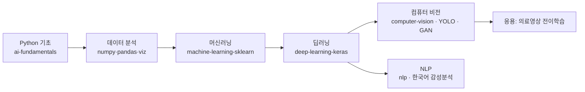

# NVIDIA AI Academy Seoul — AI Engineering Portfolio

**서울 엔비디아 아카데미 · AI 코어 엔지니어 과정 학습 포트폴리오**
정리·큐레이션: [@Seungpyo1007](https://github.com/Seungpyo1007)

> **Disclaimer / 고지.** 본 조직은 **NVIDIA와 무관한 비공식 개인 학습 포트폴리오**입니다.
> *This is an unofficial personal learning portfolio and is **not affiliated with, endorsed by, or sponsored by NVIDIA Corporation.*** 조직명은 수강한 교육과정(서울 엔비디아 아카데미)을 나타내기 위한 것일 뿐입니다.

---

## 소개

AI 코어 엔지니어 교육과정에서 **파이썬 기초부터 생성 모델(GAN)까지** 밟아온 학습 여정을, 단순 실습 파일 모음이 아니라 **주제별로 완결된 저장소**로 재구성했습니다. 각 저장소는 개요·방법론·결과·실행법을 갖춘 하나의 독립된 프로젝트입니다.

## 대표 프로젝트 (Flagship)

| 프로젝트 | 한 줄 소개 | 분야 |
|---|---|---|
| [**gan-mnist-image-generation**](https://github.com/NvidiaSeoul/gan-mnist-image-generation) | DCGAN으로 손글씨 숫자 생성, 학습 진행 시각화 | Generative |
| [**yolo-object-detection**](https://github.com/NvidiaSeoul/yolo-object-detection) | YOLOv5 커스텀 과일 검출 + YOLOv8 추론 | Object Detection |
| [**korean-movie-review-sentiment**](https://github.com/NvidiaSeoul/korean-movie-review-sentiment) | 형태소 분석 + LSTM 한국어 감성 분석 | NLP |
| [**medical-ct-transfer-learning**](https://github.com/NvidiaSeoul/medical-ct-transfer-learning) | 폐 CT 영상 전이학습 분류 | Medical CV |

## 커리큘럼 저장소 (Foundations → Advanced)

| 저장소 | 내용 |
|---|---|
| [ai-fundamentals](https://github.com/NvidiaSeoul/ai-fundamentals) | 파이썬 문법·OOP·파일IO·정규식·크롤링 + NumPy/Pandas/시각화 |
| [machine-learning-sklearn](https://github.com/NvidiaSeoul/machine-learning-sklearn) | KNN·회귀·SVM·결정트리·KMeans (scikit-learn) |
| [deep-learning-keras](https://github.com/NvidiaSeoul/deep-learning-keras) | Keras MLP·배치정규화·오토인코더 |
| [computer-vision](https://github.com/NvidiaSeoul/computer-vision) | CNN 이미지 분류·데이터 증강 |
| [nlp](https://github.com/NvidiaSeoul/nlp) | 나이브베이즈·워드임베딩·SimpleRNN |

## 학습 로드맵

## 기술 스택

- **언어/도구**: Python, Git, Jupyter
- **데이터**: NumPy, pandas, Matplotlib, seaborn, BeautifulSoup
- **ML**: scikit-learn
- **DL**: TensorFlow / Keras
- **CV**: CNN, VGG16 전이학습, YOLOv5/v8, DCGAN
- **NLP**: KoNLPy(형태소 분석), Word Embedding, RNN/LSTM

## About

이 포트폴리오의 저자 프로필 → **[@Seungpyo1007](https://github.com/Seungpyo1007)**
교육과정이 진행되며(2차·3차 …) 각 주제 저장소는 계속 심화·확장됩니다.

© 2026 Seungpyo1007 · MIT License · Unofficial learning portfolio, not affiliated with NVIDIA.

