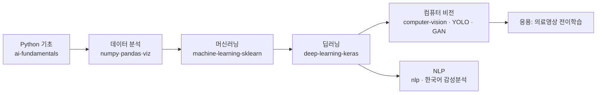

# NVIDIA AI Academy Seoul — AI Engineering Portfolio

**서울 엔비디아 아카데미 · AI 코어 엔지니어 과정 학습 포트폴리오**
정리·큐레이션: [@Seungpyo1007](https://github.com/Seungpyo1007)

> **Disclaimer / 고지.** 본 조직은 **NVIDIA와 무관한 비공식 개인 학습 포트폴리오**입니다.
> *This is an unofficial personal learning portfolio and is **not affiliated with, endorsed by, or sponsored by NVIDIA Corporation.*** 조직명은 수강한 교육과정(서울 엔비디아 아카데미)을 나타내기 위한 것일 뿐입니다.

---

## 소개

AI 코어 엔지니어 교육과정에서 **파이썬 기초부터 생성 모델·AI 에이전트까지** 밟아온 학습 여정을, 단순 실습 파일 모음이 아니라 **주제별로 완결된 저장소**로 재구성했습니다. 각 저장소는 개요·방법론·결과·실행법을 갖춘 하나의 독립된 프로젝트입니다.

## 프로젝트 결과물

각 저장소의 실제 실행 결과입니다. 지표를 만들어 넣지 않고, 코드를 돌려 나온 산출물만 담았습니다.

## 대표 프로젝트 (Flagship)

| 프로젝트 | 한 줄 소개 | 분야 |
|---|---|---|
| [**gan-mnist-image-generation**](https://github.com/NvidiaSeoul/gan-mnist-image-generation) | DCGAN으로 손글씨 숫자 생성, 학습 진행 시각화 | Generative |
| [**yolo-object-detection**](https://github.com/NvidiaSeoul/yolo-object-detection) | YOLOv5 커스텀 과일 검출 + YOLOv8 추론 | Object Detection |
| [**korean-movie-review-sentiment**](https://github.com/NvidiaSeoul/korean-movie-review-sentiment) | 형태소 분석 + LSTM 한국어 감성 분석 | NLP |
| [**medical-ct-transfer-learning**](https://github.com/NvidiaSeoul/medical-ct-transfer-learning) | 폐 CT 영상 전이학습 분류 | Medical CV |

## 커리큘럼 저장소 (Foundations → Advanced)

| 저장소 | 내용 |
|---|---|
| [ai-fundamentals](https://github.com/NvidiaSeoul/ai-fundamentals) | 파이썬 문법·OOP·파일IO·정규식·크롤링 + NumPy/Pandas/시각화 |
| [machine-learning-sklearn](https://github.com/NvidiaSeoul/machine-learning-sklearn) | KNN·회귀·SVM·결정트리·KMeans (scikit-learn) |
| [deep-learning-keras](https://github.com/NvidiaSeoul/deep-learning-keras) | Keras MLP·배치정규화·오토인코더 |
| [pytorch-fundamentals](https://github.com/NvidiaSeoul/pytorch-fundamentals) | PyTorch 기초 — Iris MLP·활성화 함수 |
| [pytorch-mnist-classification](https://github.com/NvidiaSeoul/pytorch-mnist-classification) | PyTorch MNIST·과적합·정규화 |
| [computer-vision](https://github.com/NvidiaSeoul/computer-vision) | CNN 이미지 분류·데이터 증강 |
| [opencv-image-processing](https://github.com/NvidiaSeoul/opencv-image-processing) | OpenCV 영상처리 기초 |
| [data-analysis-penguins](https://github.com/NvidiaSeoul/data-analysis-penguins) | pandas EDA·시각화 (Palmer Penguins) |
| [nlp](https://github.com/NvidiaSeoul/nlp) | 나이브베이즈·워드임베딩·SimpleRNN |

## 심화 — 컴퓨터 비전 & 생성 모델

| 저장소 | 내용 |
|---|---|
| [pytorch-object-detection](https://github.com/NvidiaSeoul/pytorch-object-detection) | 단일 객체 탐지 — VOC XML·바운딩박스·CNN |
| [semantic-segmentation](https://github.com/NvidiaSeoul/semantic-segmentation) | 시맨틱 세그멘테이션 — FCN & U-Net |
| [generative-models](https://github.com/NvidiaSeoul/generative-models) | 생성 모델 — VAE(PyTorch) & DCGAN(TensorFlow) |

## 최종 프로젝트 — BrandGuard

### [브랜드 리스크 조기탐지 및 대응 Agent](https://github.com/NvidiaSeoul/brandguard-risk-agent)

**온라인 여론에서 브랜드 위기의 전조를 포착해, 원인 분석과 대응안까지 자동 생성하는 AI 에이전트**

브랜드 위기는 **속도의 문제**입니다. 초기 몇 시간의 대응이 피해 규모를 좌우하지만, 기존 모니터링은 "언급량 집계와 대시보드 조회"에 머물러 담당자가 직접 지표를 해석해야 합니다.

BrandGuard는 뉴스·블로그·웹 언급을 수집해 **6개 특징 그룹**(언급량·증가속도·감성·키워드·작성자·확산)으로 정량화하고, **Isolation Forest + 룰 엔진**으로 위험도를 3단계로 판정합니다. 그다음 **LangGraph 상태기계**가 위험도에 따라 경로를 분기해 원인을 분석하고 대응 리포트를 만든 뒤, **담당자 승인(Human-in-the-Loop)** 을 거쳐야만 알림을 발송합니다.

| 특징 | 설명 |
|---|---|
| **오탐을 줄이는 설계** | 정상적 급증(신제품·이벤트)과 실제 리스크를 감성·키워드·작성자 패턴으로 구분. 학습(평상시) 분포 기준으로 스코어를 정규화해 평상시 오탐 제거 |
| **봇·노이즈 판별** | 소수 계정 반복 작성·신규 계정 비중으로 인위적 여론 조성 탐지 |
| **근거를 제시하는 탐지** | "언급량 급증(108건, 평상시 14건) · 부정 여론 73%(평상시 16%) · 5.7배 증가"처럼 판단 이유를 사람이 읽을 수 있게 출력 |
| **채널별 감성 분석** | 실측 비교 후 커뮤니티·SNS는 한국어 모델, 뉴스는 사전 기반으로 라우팅 |
| **전 계층 구현** | 수집 4채널 · 이상탐지 · LangGraph 에이전트 · Streamlit 대시보드 · FastAPI 12개 엔드포인트 · 스케줄러 · Slack/이메일 알림 · SQLite/PostgreSQL |

> 약 2,500줄 · 테스트 6/6 통과 · **API 키 없이도 전체 파이프라인이 동작**(데모 데이터·규칙 기반 자동 폴백)

**→ [저장소 바로가기](https://github.com/NvidiaSeoul/brandguard-risk-agent)**

## AI 에이전트 (LangChain · LangGraph)

| 저장소 | 내용 |
|---|---|
| [company-analysis-agent](https://github.com/NvidiaSeoul/company-analysis-agent) | LangGraph 기업분석 에이전트 — 시세·뉴스 수집·리랭킹 → Word 보고서 |
| [travel-planner-agent](https://github.com/NvidiaSeoul/travel-planner-agent) | Streamlit 여행일정 에이전트 — 구조화 출력 + 지도 동선 시각화 |
| [ai-agent-course](https://github.com/NvidiaSeoul/ai-agent-course) | 에이전트 개발 실습 — LangChain·RAG·LangGraph·스트리밍·FastAPI (13개 주제) |

## 이론 정리

| 저장소 | 내용 |
|---|---|
| [nvidia-dli-deep-learning-notes](https://github.com/NvidiaSeoul/nvidia-dli-deep-learning-notes) | NVIDIA DLI 딥러닝 입문 과정 한국어 학습 노트 (7개 섹션) |

## 학습 로드맵

```mermaid
flowchart LR
    A["Python 기초<br/>ai-fundamentals"] --> B["데이터 분석<br/>numpy·pandas·viz"]
    B --> C["머신러닝<br/>machine-learning-sklearn"]
    C --> D["딥러닝<br/>deep-learning-keras"]
    D --> E["컴퓨터 비전<br/>computer-vision · YOLO · GAN"]
    D --> F["NLP<br/>nlp · 한국어 감성분석"]
    E --> G["응용: 의료영상 전이학습"]
```

## 기술 스택

- **언어/도구**: Python, Git, Jupyter
- **데이터**: NumPy, pandas, Matplotlib, seaborn, BeautifulSoup
- **ML**: scikit-learn
- **DL**: TensorFlow / Keras
- **CV**: CNN, VGG16 전이학습, YOLOv5/v8, DCGAN
- **NLP**: KoNLPy(형태소 분석), Word Embedding, RNN/LSTM

## About

이 포트폴리오의 저자 프로필 → **[@Seungpyo1007](https://github.com/Seungpyo1007)**
교육과정이 진행되며(2차·3차 …) 각 주제 저장소는 계속 심화·확장됩니다.

© 2026 Seungpyo1007 · MIT License · Unofficial learning portfolio, not affiliated with NVIDIA.

